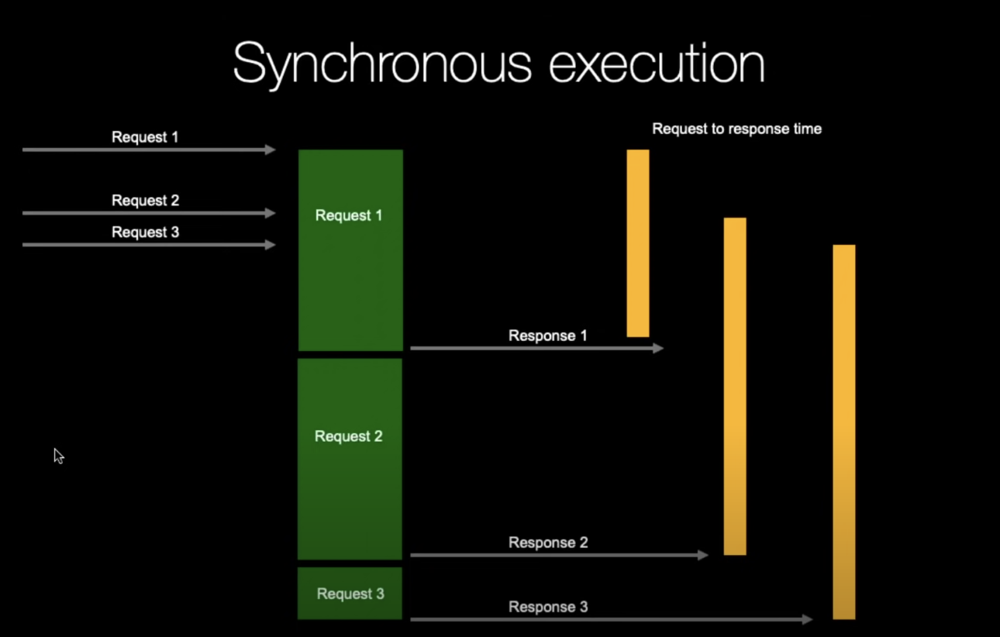
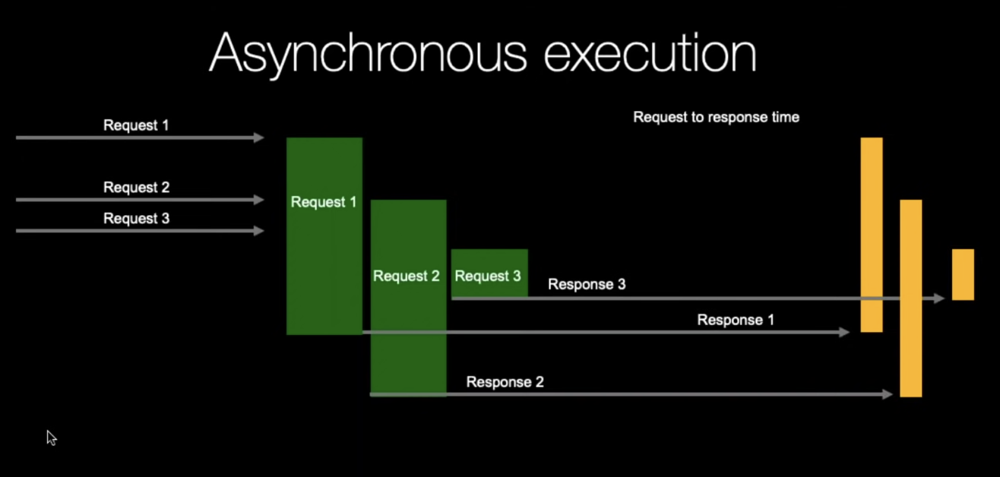

# Async Python

**Moore's Law:** Number of transistors in an Integrated circuit doubles every two years. Performance is not increasing. We are no longer able to add more clock speed. Number of cores are increasing.

**A decision to make on when to use async:**
- We cannot decide to use concurrent operations when we are waiting for a transaction to complete and send out a success notification while we are waiting. Some operations need to be synchronous.
- We can use for other scenarios where we are waiting for some time consuming operation, we can perform other operations meanwhile.

**Sync vs Async**

In the second one we do productive waiting.

Python's asyncio/threads --> Do more at once.
Multiprocessing/Cython --> Do things faster.
trio/unsync --> Do things easier.

**GIL**
Global interpreter lock: why threads don't add computational speed. Only one interpreter instruction at a time.

[Source](https://github.com/mikeckennedy/async-await-jetbrains-webcast/tree/master)